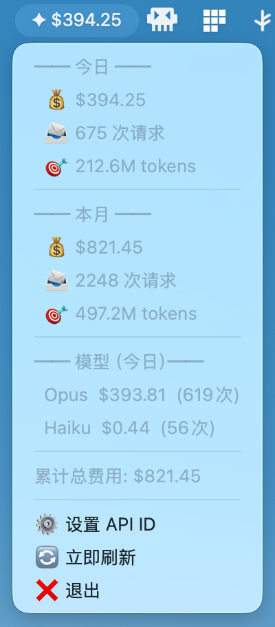
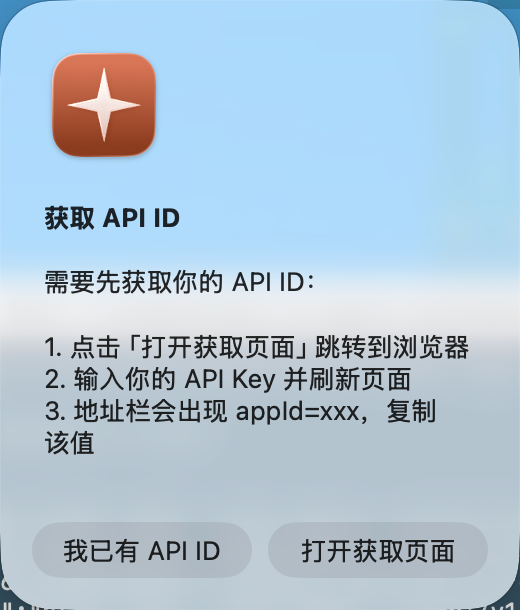
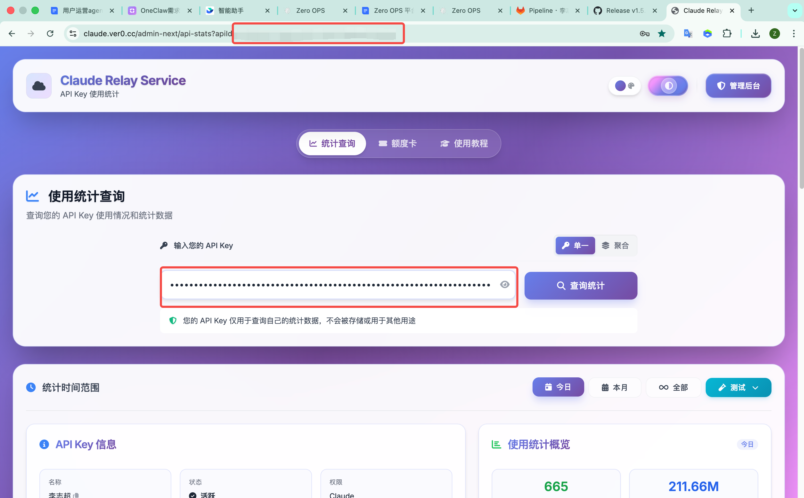

# ClaudeUsage

macOS 菜单栏小组件，实时显示 Claude API 用量统计。

常驻菜单栏，一目了然查看今日/本月费用、请求次数、Token 用量及模型明细。

## 预览

<p align="center">
  
</p>

## 功能

- 菜单栏实时显示今日费用
- 展开查看今日/本月详细统计（费用、请求数、Token 数）
- 按模型分类（Opus、Sonnet、Haiku）展示用量
- 可配置刷新间隔（默认 5 分钟）
- 启动时自动检查更新

## 安装

### 1. 下载

前往 [Releases](https://github.com/lllzzzcccc/claude-usage-widget/releases/latest) 页面，下载最新版 `ClaudeUsage.zip`。

### 2. 解压并安装

解压后将 `ClaudeUsage.app` 拖入 `/Applications` 或 `~/Applications`。

### 3. 移除隔离标记

首次打开前，需在终端执行以下命令（macOS 对未签名应用的安全限制）：

```bash
xattr -cr /Applications/ClaudeUsage.app
```

### 4. 启动

双击打开 `ClaudeUsage.app`。

## 配置 API ID

首次启动会弹出引导窗口，按以下步骤获取你的 API ID：

### Step 1: 点击「打开获取页面」

<p align="center">
  
</p>

点击后会自动跳转到浏览器。如已有 API ID，点击「我已有 API ID」直接输入。

### Step 2: 在网页中获取 API ID

<p align="center">
  
</p>

1. 在网页中输入你的 **API Key**，点击「查询统计」
2. 页面刷新后，查看浏览器**地址栏**
3. URL 中会出现 `appId=xxx`，复制 `=` 后面的值

### Step 3: 粘贴 API ID

<p align="center">
  
</p>

将复制的 API ID 粘贴到输入框，点击「确定」即可开始使用。

> 后续可随时通过菜单栏下拉菜单中的「设置 API ID」修改。

## 配置文件

配置保存在 `~/.claude_usage/config.json`：

```json
{
  "api_id": "你的 API ID",
  "refresh_seconds": 300
}
```

| 字段 | 说明 | 默认值 |
|------|------|--------|
| `api_id` | 你的 API ID | - |
| `refresh_seconds` | 数据刷新间隔（秒） | 300 |

## 本地开发

```bash
# 安装依赖
pip install -r requirements.txt

# 运行
python3 widget.py
```

## License

MIT
